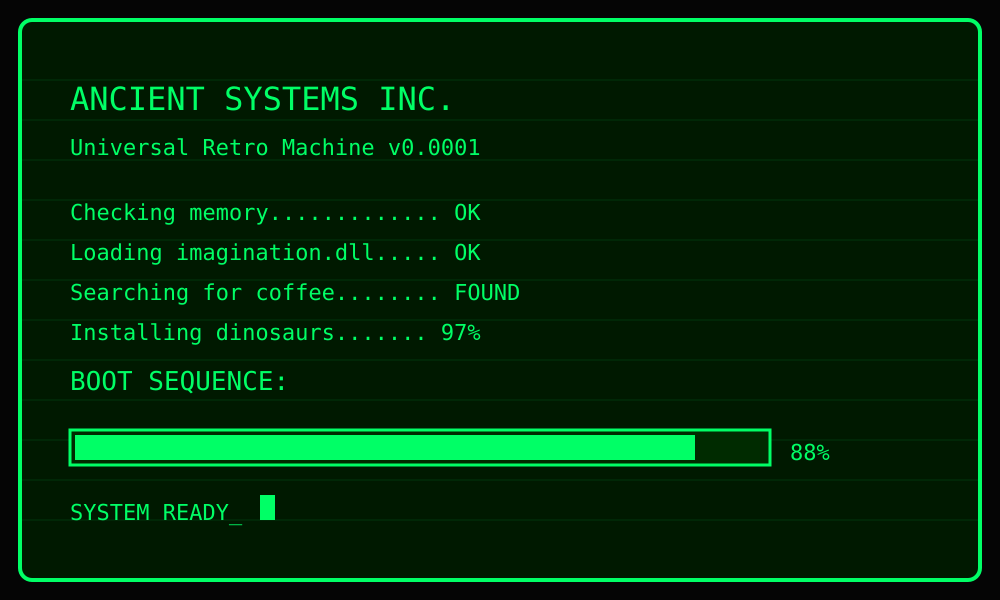

# github.com-NoirW01F-D3v-NoirW01F-D3v
whoami

  

  

  
 • Android-Developer •  

_________________________________________

Current Projects 
+ 
 YinD Launcher 
 Nunscrib
 etc... 

-----------------------------------------
Feature list. 

  </text>

  <text x="60"
        y="160"
        fill="#82dfff"
        font-size="18"
        font-family="monospace">
        Java • C • C++ • Python • Bash • Kotlin
  </text>

  <text x="60"
        y="192"
        fill="#82dfff"
        font-size="18"
        font-family="monospace">
        Linux • Windows • macOS • Android • Termux
  </text>

  <text x="60"
        y="224"
        fill="#82dfff"
        font-size="18"
        font-family="monospace">
        SDK • NDK • Gradle • Git • CMake • ADB
  </text>

  <text x="60"
        y="272"
        fill="#00e5ff"
        font-size="20"
        font-family="monospace">
        Learning by Building • Breaking • Fixing • Sharing
  </text>

</svg>

